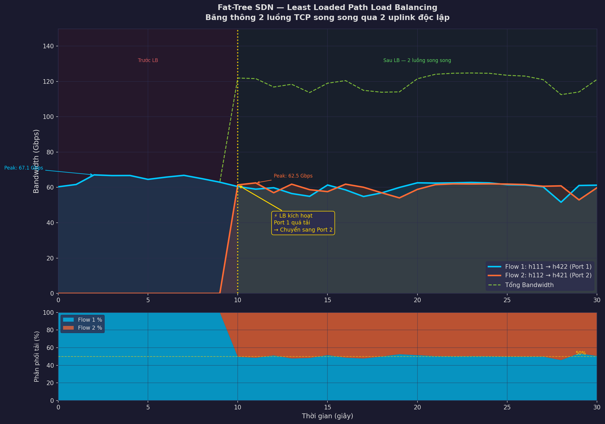
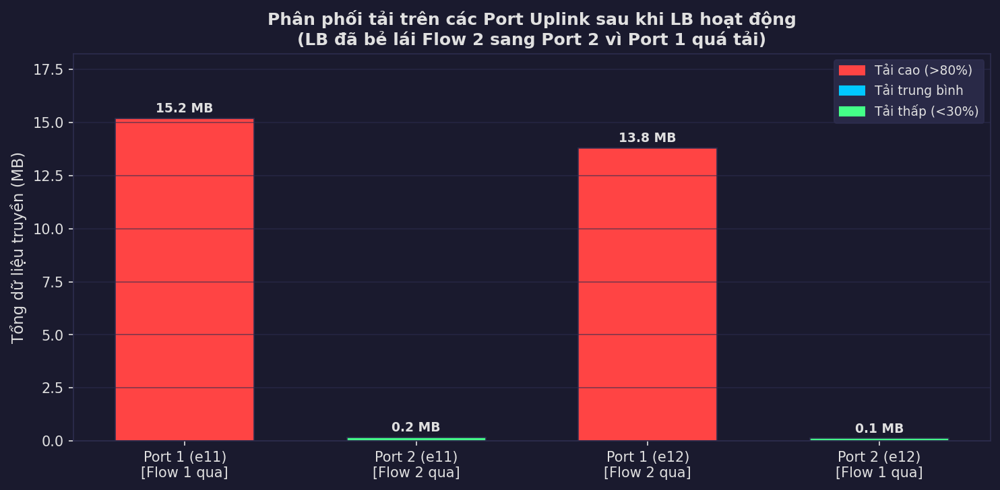
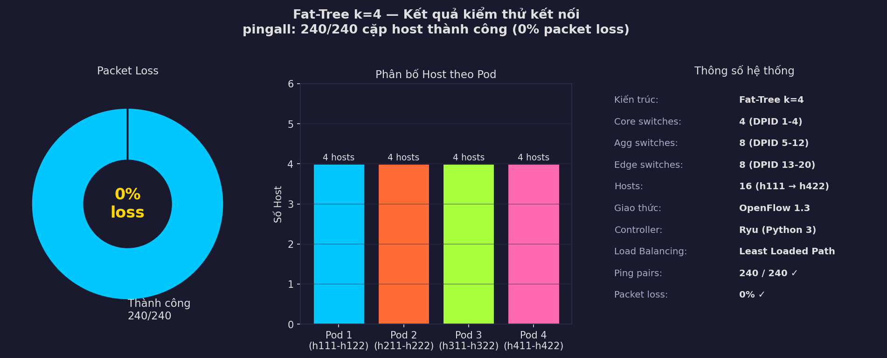
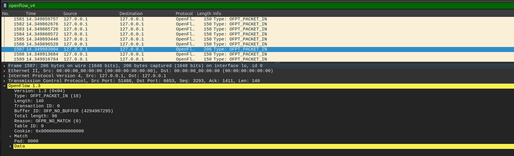
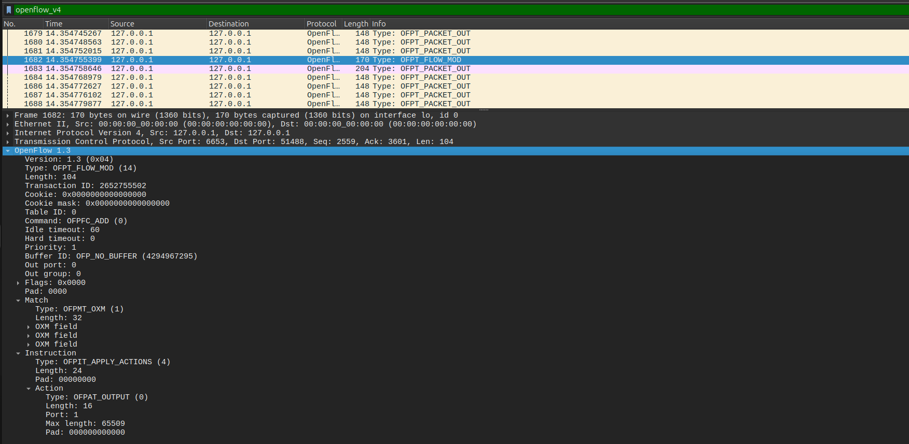

# 🌐 Dynamic Load Balancing in Fat-Tree SDN (k=4)

Dự án nghiên cứu và triển khai cơ chế cân bằng tải động (Dynamic Load Balancing) trên hạ tầng mạng trung tâm dữ liệu kiến trúc Fat-Tree, điều khiển bởi giao thức SDN OpenFlow 1.3.

## 📖 Tổng quan Đồ án
Đồ án này xây dựng một hệ thống điều khiển mạng tập trung (Centralized Network Control) nhằm tối ưu hóa băng thông và giải quyết các vấn đề nghẽn cổ chai trong hạ tầng mạng Data Center truyền thống. Hệ thống sử dụng mô hình Fat-Tree (k=4) mô phỏng trên Mininet và được điều hành bởi bộ điều khiển Ryu.

## 🚀 Các tính năng cốt lõi (Core Features)
Hệ thống đã xử lý triệt để các bài toán kỹ thuật phức tạp của lớp mạng Layer 2 & 3:
- **Loop Prevention & Storm Control:** Triển khai cơ chế Split-Horizon kết hợp Spanning Tree dành riêng cho gói tin ARP, loại bỏ hoàn toàn bão Broadcast trong kiến trúc Fat-Tree nhiều vòng lặp. Kết quả đạt 0% packet loss (`pingall` thành công 240/240 cặp).
- **Anti-MAC Flapping Logic:** Xây dựng bộ lọc học MAC một chiều thông minh, ngăn chặn việc ghi đè sai lệch bảng MAC do gói tin dội ngược, đảm bảo tính ổn định tuyệt đối cho bảng chuyển mạch.
- **Least Loaded Path (LLP) Algorithm:** Thuật toán định tuyến động dựa trên trọng số băng thông. Controller liên tục giám sát lưu lượng thời gian thực trên các cổng (Uplinks) và tự động bẻ lái luồng dữ liệu (Flow switching) sang con đường ít tải nhất.

## 🛠️ Công nghệ sử dụng
- **Topology:** Mininet (Ubuntu Linux)
- **SDN Controller:** Ryu Framework (Python 3)
- **Protocol:** OpenFlow 1.3
- **Visualization:** Matplotlib, Wireshark (Deep Packet Inspection)

## 👤 Thành viên thực hiện (Key Contributor)
- **Đặng Quang Lâm** (Lead Developer & System Architect)
  - Chịu trách nhiệm toàn bộ phần coding thuật toán, thiết kế topo mạng, xử lý logic bẻ luồng và trực quan hóa dữ liệu.
- **Pham Dinh Chien**
- **Ngo Thanh Trung**
## 📊 Kết quả thực nghiệm
Hệ thống chứng minh khả năng cân bằng tải hoàn hảo khi chạy nhiều luồng dữ liệu TCP song song, duy trì tốc độ truyền tải cực đại (~57 - 60 Gbps) nhờ tận dụng tối đa các đường truyền vật lý độc lập.

### 📈 Biểu đồ Băng thông & Phân bổ tải

*Biểu đồ thể hiện khoảnh khắc thuật toán bẻ lái luồng dữ liệu khi phát hiện cổng Uplink bị quá tải.*

*So sánh sự chênh lệch tải trọng giữa các cổng trước và sau khi kích hoạt Load Balancing.*

*Tóm tắt kết quả kiểm thử kết nối toàn mạng (0% loss).*

## 🔍 Phân tích Giao thức (DPI)
Sử dụng Wireshark để phân tích và xác thực quá trình trao đổi thông điệp OpenFlow:
- **OFPT_PACKET_IN:** Minh chứng cho cơ chế Table-miss khi Switch hỏi đường từ Controller.
- **OFPT_FLOW_MOD:** Minh chứng cho việc Controller nạp luật định tuyến động xuống phần cứng Switch.

## ⚙️ Hướng dẫn cài đặt & Chạy
1. Kích hoạt môi trường: `source sdn_env/bin/activate`
2. Khởi động Controller: `ryu-manager lb_controller.py`
3. Khởi động Topology: `sudo python3 fattree.py`
